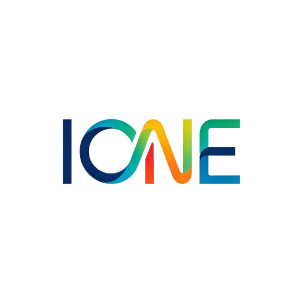

# DormInOne - 宿舍全能管家



一个功能完整的宿舍管理系统，支持多角色权限管理、室友管理、值日排班、AA记账、用电监控、物品借用、报修管理、卫生评分等功能。


## 🏠 项目介绍

DormInOne 是一款专为宿舍生活打造的全能管理工具，支持多角色权限管理，可部署在单台服务器上为全校所有楼层和宿舍提供服务。

## ✨ 功能特性

### 🔐 多角色权限系统
- **系统管理员** - 拥有最高权限，管理全校所有楼层和宿舍
- **楼层宿管** - 管理所属楼层的所有宿舍
- **宿舍舍长** - 管理本宿舍事务，可为成员创建账号
- **宿舍成员** - 查看信息并提交申请

### 🎟️ 邀请码系统
- 楼层邀请码：绑定整楼层，有效期24小时
- 宿舍邀请码：绑定单个宿舍，有效期24小时
- 邀请码使用后立即失效，支持重新生成

### 🏠 核心功能
- **成员管理** - 添加、编辑、删除成员信息
- **床位分配** - 管理宿舍床位分配
- **📅 值日排班** - 每周清洁任务分配
- **💰 AA记账** - 记录支出和收入，支持费用分摊
- **⚡ 水电监控** - 记录用电量、用水量和费用
- **📦 物品借用** - 管理共享物品的借用状态
- **🔧 报修记录** - 提交和处理报修申请
- **⭐ 卫生评分** - 宿舍卫生检查和评分
- **⚙️ 系统设置** - 深色模式、数据管理

## 🛠️ 技术栈

| 分类 | 技术 |
|------|------|
| 前端框架 | Vue 3 + Vite |
| 状态管理 | Pinia |
| 路由 | Vue Router |
| UI样式 | Tailwind CSS 3 |
| 图标 | Lucide Vue |
| 后端 | Node.js + Express |
| 数据存储 | JSON 文件 |

## 🚀 快速开始

### 环境要求

- Node.js >= 18.0.0
- npm >= 9.0.0

### 启动方式

#### 方式一：一键启动（推荐）

```bash
# Windows PowerShell
.\start.ps1
```

#### 方式二：手动启动

**启动后端服务：**

```bash
cd server
npm install
node server.js
```

**启动前端服务：**

```bash
cd client
npm install
npm run dev
```

### 访问地址

- 前端页面: http://localhost:5173
- 后端API: http://localhost:3000

## 📁 项目结构

```
dorminone/
├── client/                    # 前端项目
│   ├── src/
│   │   ├── components/        # 组件
│   │   │   ├── Header.vue     # 顶部导航
│   │   │   ├── Sidebar.vue    # 侧边栏
│   │   │   ├── Toast.vue      # 提示组件
│   │   │   ├── ToastContainer.vue
│   │   │   └── ConfirmModal.vue  # 确认对话框
│   │   ├── views/             # 页面视图
│   │   │   ├── Dashboard.vue  # 首页仪表盘
│   │   │   ├── Login.vue      # 登录页面
│   │   │   ├── Onboarding.vue # 欢迎引导页
│   │   │   ├── FloorManagement.vue  # 楼层管理
│   │   │   ├── DormitoryManagement.vue # 宿舍管理
│   │   │   ├── UserManagement.vue    # 用户管理
│   │   │   ├── Roommates.vue  # 成员管理
│   │   │   ├── Beds.vue       # 床位管理
│   │   │   ├── Schedule.vue   # 值日排班
│   │   │   ├── Bills.vue      # AA记账
│   │   │   ├── Electricity.vue # 水电监控
│   │   │   ├── Items.vue      # 物品借用
│   │   │   ├── Repairs.vue    # 报修记录
│   │   │   ├── Clean.vue      # 卫生评分
│   │   │   └── Settings.vue   # 系统设置
│   │   ├── stores/            # Pinia状态管理
│   │   ├── services/          # API服务
│   │   ├── composables/       # 组合式函数
│   │   └── router/            # 路由配置
│   └── package.json
├── server/                    # 后端项目
│   ├── data/                  # JSON数据文件
│   ├── server.js              # 服务器入口
│   └── package.json
├── start.ps1                  # 一键启动脚本
└── README.md
```

## 👥 角色权限说明

### 系统管理员
- ✅ 创建/删除楼层和宿舍
- ✅ 生成/重置邀请码
- ✅ 查看和管理所有用户
- ✅ 删除所有数据
- ✅ 访问所有功能模块

### 楼层宿管
- ✅ 查看所属楼层所有宿舍
- ✅ 处理报修申请
- ✅ 审核卫生评分
- ✅ 查看水电数据
- ❌ 不能创建/删除楼层
- ❌ 不能生成邀请码

### 宿舍舍长
- ✅ 管理本宿舍成员
- ✅ 创建成员账号
- ✅ 管理床位分配
- ✅ 管理值日排班
- ❌ 不能管理其他宿舍

### 宿舍成员
- ✅ 查看成员列表
- ✅ 查看值日安排
- ✅ 提交报修申请
- ❌ 无任何管理权限

## 🔌 API 接口

| 模块 | 方法 | 路径 | 描述 |
|------|------|------|------|
| 认证 | POST | /api/login | 用户登录 |
| 认证 | POST | /api/validate-invite | 验证邀请码 |
| 认证 | POST | /api/bind-role | 绑定角色 |
| 楼层 | GET | /api/floors | 获取所有楼层 |
| 楼层 | POST | /api/floors | 创建楼层 |
| 楼层 | DELETE | /api/floors/:id | 删除楼层 |
| 楼层 | POST | /api/floors/:id/regenerate-invite | 重新生成邀请码 |
| 宿舍 | GET | /api/dormitories | 获取所有宿舍 |
| 宿舍 | POST | /api/dormitories | 创建宿舍 |
| 宿舍 | DELETE | /api/dormitories/:id | 删除宿舍 |
| 用户 | GET | /api/users | 获取所有用户 |
| 用户 | POST | /api/users | 创建用户 |
| 用户 | DELETE | /api/users/:id | 删除用户 |
| 室友 | GET | /api/roommates | 获取所有室友 |
| 室友 | POST | /api/roommates | 添加室友 |
| 室友 | PUT | /api/roommates/:id | 更新室友 |
| 室友 | DELETE | /api/roommates/:id | 删除室友 |
| 排班 | GET | /api/schedule | 获取排班表 |
| 排班 | POST | /api/schedule | 添加排班 |
| 账单 | GET | /api/bills | 获取账单 |
| 账单 | POST | /api/bills | 添加账单 |
| 用电 | GET | /api/electricity | 获取用电记录 |
| 用电 | POST | /api/electricity | 添加用电记录 |
| 物品 | GET | /api/items | 获取物品列表 |
| 物品 | POST | /api/items | 添加物品 |
| 报修 | GET | /api/repairs | 获取报修记录 |
| 报修 | POST | /api/repairs | 提交报修 |
| 卫生 | GET | /api/clean | 获取卫生评分 |
| 卫生 | POST | /api/clean | 添加评分 |
| 数据 | DELETE | /api/all-data | 删除所有数据（管理员） |

## 🎨 界面预览

### 深色模式
支持一键切换深色/浅色模式，保护眼睛。

### Toast 提醒
美观的动画提示，替代原生弹窗。

### 确认对话框
优雅的模态对话框，带有动画效果。

## 🔒 安全特性

- 角色权限控制
- 数据级权限过滤
- 邀请码有效期限制
- 邀请码一次性使用

*DormInOne(DIO) team built with ❤️*
